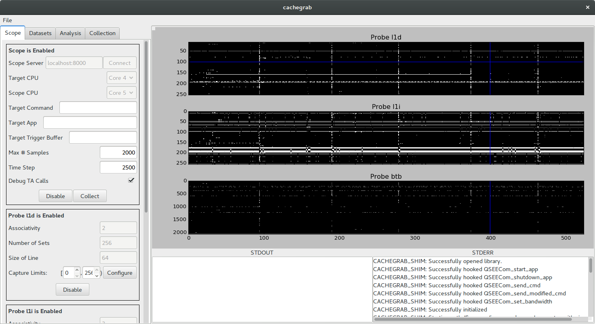

# Cachegrab
Cachegrab is a tool designed to help perform and visualize trace-driven cache
attacks against software in the secure world of TrustZone-enabled ARMv8 cores.
For an overview of how Cachegrab works under the hood, see
[the Cachegrab release announcement](https://www.nccgroup.trust/us/about-us/newsroom-and-events/blog/2017/december/34C3-Tool-Release-Cachegrab/).

## Using Cachegrab on Android
It is possible to use Cachegrab on an Android device. Since modern
versions of Android disallow kernel modules, the `CONFIG_MODULES` and
`CONFIG_MODULE_UNLOAD` kernel options should be enabled, the kernel
rebuilt, and flashed to the device. Build the Cachegrab kernel module
against the kernel source and use `insmod` to insert it into the target
device's running kernel.

Next, build the Cachegrab server and shim library and copy both to
`/data/local/tmp`. Start the server. Finally, use
`adb forward tcp:8000 tcp:8000` to bind the local TCP port 8000 to the
device's.

**Warning:** The server allows the attacker to specify arbitrary shell
commands to invoke the victim code. These commands are specified over HTTP
and run with root privileges, so it is critical that the test device
running Cachegrab is on a trusted network.

Finally, load the Cachegrab GUI and connect to `localhost:8000`.

## Understanding the Cachegrab Client
The Cachegrab client is structured around the idea of a pipeline, which
process the samples containing the attack data. Pipelines consist of a
sample source, a list of filters, and an analyzer. The sample source
could be a location on the filesystem, a device running the Cachegrab
server, or something custom. The pipeline collects samples from the
source and passes each through the filters in the pipeline, which are
able to modify the data in the sample. Finally, the filtered samples
are passed to the analyzer, which does final processing of the attack
data.

Much of the client can be interacted with using the GUI, which provides
a simple way to manage a pair of useful pipelines. The first pipeline
collects samples from the Cachegrab server configured in the "Scope"
panel. It passes these samples through a series of filters and stores
the resulting filtered samples in a dataset. Datasets can be imported
or exported using the GUI, allowing for easy transfer of sample data.
The second pipeline takes samples from a dataset, runs the samples
through another series of filters, and plots the filtered traces to
the window.



The cachegrab client Python module can also be used directly to make
a collection or analysis script. The following script takes a dataset
exported by the GUI, does some processing on the traces in each sample,
and prints out the resulting data.

```
from cachegrab import Pipeline
from cachegrab.data import Dataset, Trace
from cachegrab.sources import DatasetSource
from cachegrab.filters import Filter
from cachegrab.sinks import AnalysisSink

class SampleFilter(Filter):
    def filter(self, sample):
        for t in sample.get_trace_names():
            data = sample.get_trace(t).data
            sample.set_trace(t, Trace(data - data.mean()))
        return sample

class SampleAnalysis(AnalysisSink):
    def analyze_once(self, sample):
        for t in sample.get_trace_names():
            print sample.get_trace(t).data

dataset = Dataset().load("exported_dataset_location")
pipeline = Pipeline(DatasetSource(dataset), SampleAnalysis())
pipeline.add_filter(SampleFilter())
pipeline.run()
```
